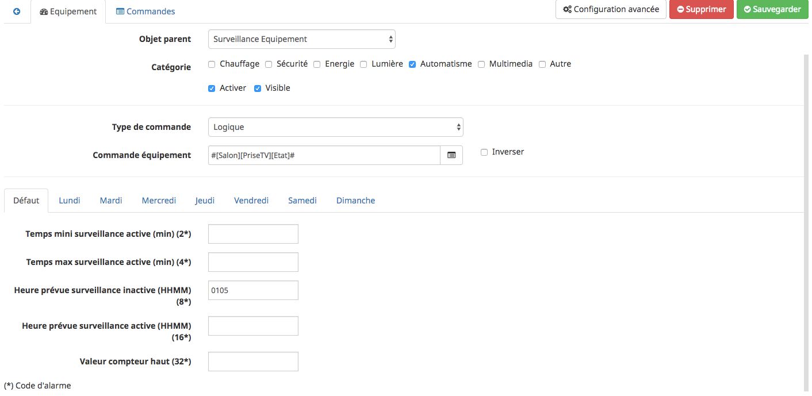
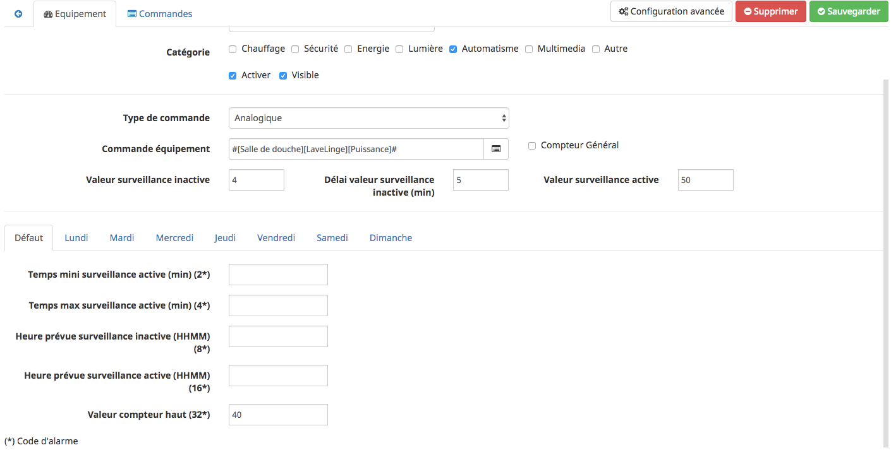
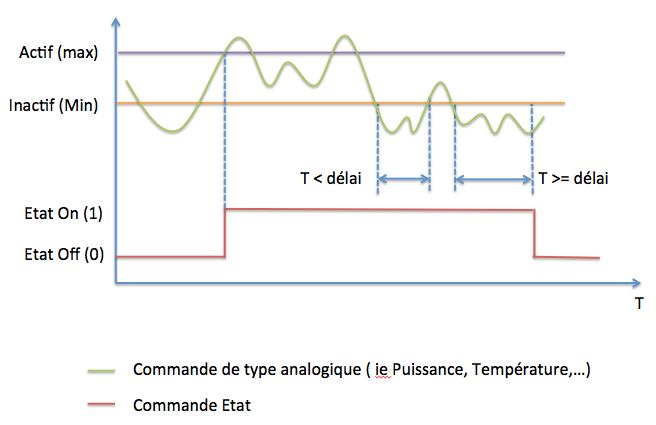
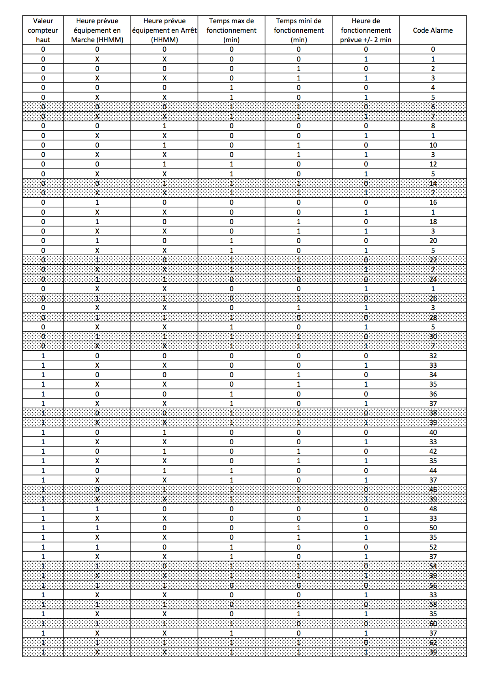

# Plugin Surveillance Equipement (id : ethalsurveillance) Description

Plugin servant à la surveillance d’un équipement.

# Présentation

La surveillance de l’équipement est faite à partir d’une commande ***Logique*** (ie etat,…) ou d’une commande de mesure ***analogique*** (puissance,temperature,…)

Il permet de connaître le temps où la commande de l’équipement est active,+ il gère une commande d’alarme, en fonction d’un temps minimun et/ou maximun où la commande de l’équipement est active, d’une heure prévue où la commande de l’équipement est inactif ou actif, d’une valeur haute sur un compteur,ces paramètres sont disponible pour une gestion hebdomadaire.

Un code d’alarme, permet de connaître la cause de l’alarme,
Un compteur de cycle d’activité de l’équipement,
Des actions peuvent etre configurer en fonction de la valeur des commandes Etat et Alarme.

Ci dessous des exemples de widget.

Un panel pour la visualisation graphique du temps d’activité de l’équipement est disponible depuis le menu Acceuil→Surveillance Equipement

# Configuration

### Onglet Equipement
 * Type de commande : Type de la commande qui servira à surveiller l’équipement , Logique ou Analogique,

   * Commande de l’équipement à surveiller de type "Logique"

  

 * ***Commande équipement*** : Commande d’état de l’équipement à surveiller

 * ***Inverser*** : Inversion de la commande d’état de l’équipement à surveiller

 * ***Temps mini surveillance active (min)*** : Temps de surveillance minimun de l’équipement pour générer une alarme, laisser vide pour ne pas générer d’alarme

 * ***Temps max surveillance active (min)*** : Temps de surveillancet maximun de l’équipement pour générer une alarme, laisser vide pour ne pas générer d’alarme

 * ***Heure prévue surveillance inactive (HHMM)*** : heure à laquelle l’équipement (ie la commande ***Etat***) est prévu d’être à OFF, laisser vide pour ne pas générer d’alarme

 * ***Heure prévue surveillance active (HHMM)*** : heure à laquelle l’équipement (ie la commande ***Etat***) est prévu d’être à ON, laisser vide pour ne pas générer d’alarme

 * ***Valeur compteur haut*** : Valeur haute du compteur pour générer une alarme, laisser vide pour ne pas générer d’alarme

   * Commande de l’équipement à surveiller de type "Analogique" avec Compteur Général coché

  

 * ***Commande équipement*** : Commande de mesure analogique de l’équipement à surveiller

 * ***Compteur Général*** : coché si la Commande équipement est une mesure analogique globale (ie mesure de puissance globale de votre logement)

 * ***Heure de surveillance prévue +/- 2 min (HHMM)*** : obligatoire si ***Compteur Général*** coché

 * ***Valeur surveillance active*** : obligatoire si ***Compteur Général*** coché, doit être vide dans le cas contraire

 * ***Temps mini surveillance active (min)*** : Temps de surveillance minimun de l’équipement pour générer une alarme, laisser vide pour ne pas générer d’alarme

 * ***Temps max surveillance active (min)*** : Temps de surveillance maximun de l’équipement pour générer une alarme, laisser vide pour ne pas générer d’alarme

 * ***Valeur compteur haut*** : Valeur haute du compteur pour générer une alarme, laisser vide pour ne pas générer d’alarme

   * Commande de l’équipement à surveiller de type "Analogique" avec Compteur Général NON coché

   

 * ***Commande équipement*** : Commande de mesure analogique de l’équipement à surveiller

 * ***Compteur Général*** : NON coché

 * ***Valeur surveillance inactive*** : obligatoire si ***Compteur Général*** NON coché, valeur analogique en dessous de laquelle l’équipement à surveiller est considéré inactif (voir également la description de Délai valeur surveillance inactive (min) ci dessous

 * ***Délai valeur surveillance inactive (min)*** : Delai en minute pour lequel la ***valeur surveillance inactive*** est considéré comme valide

 * ***Valeur surveillance active*** : obligatoire si ***Compteur Général*** NON coché, valeur analogique au dessus de laquelle l’équipement à surveiller est considéré actif

 * ***Temps mini surveillance active (min)*** : Temps de surveillance minimun de l’équipement pour générer une alarme, laisser vide pour ne pas générer d’alarme

 * ***Temps max surveillance active (min)*** : Temps de surveillance maximun de l’équipement pour générer une alarme, laisser vide pour ne pas générer d’alarme

 * ***Heure prévue surveillance inactive (HHMM)*** : heure à laquelle l’équipement (ie commande ***Etat***) est prévu d’être à OFF, laisser vide pour ne pas générer d’alarme

 * ***Heure prévue surveillance active (HHMM)*** : heure à laquelle l’équipement (ie commande ***Etat***) est prévu d’être à ON,laisser vide pour ne pas générer d’alarme

 * ***Valeur compteur haut*** : Valeur haute du compteur pour générer une alarme, laisser vide pour ne pas générer d’alarme

> **Note**
>
> Les valeurs definit dans les onglets des jours de la semaine sont prioritaires à celles définit dans l’onglet défaut

> **Note**
>
> Il peut y avoir une latence de 5 minutes au déclenchement de l’alarme sur les paramètres ***Heure prévue surveillance Inactif (HHMM)*** et ***Heure prévue surveillance Actif (HHMM)***

> **Important**
>
> La commande équipement doit être de type "info et de sous type "numeric" pour un ***Type de commande*** analogique, la commande équipement doit être de type "info et de sous type "binary" pour un ***Type de commande*** logique

> **Important**
>
> Vous ne pouvez créer qu’un seul équipement à surveiller avec l’option ***Compteur Général***, (ie une mesure de puissance globale de votre logement par exemple).

### Onglet Commande

Les commandes sont crées automatiquement à la sauvegarde de l’équipement, il n’est pas possible d’en ajouter, d’en supprimer. Utiliser la case à cocher ***afficher***, si vous ne souhaitez pas voir certaines commandes sur le widget.

 * ***Alarme*** : statut d’alarme de l’équipement (1 = ALARME = ON, 0 = OFF)

 * ***Code Alarme*** : somme des codes d’alarme ayant déclenchés l’alarme , voir ci-dessous les valeurs des codes d’alarme

 * ***Temps Actif(H:M:S)*** : Temps d’activité de l’équipement au format Heure:Minute:Seconde

 * ***Temps Actif*** : Temps d’activité de l’équipement en secondes

 * ***Temps Actif Total(H:M:S)*** : Temps d’activité de l’équipement au format Heure:Minute:Seconde

 * ***Temps Actif Total*** : Temps d’activité de l’équipement en secondes

 * ***RAZ Tps Actif Total*** : remise à zero du temps d’activité total (commande ***Temps Actif Total(H:M:S)*** et ***Temps Actif Total***)

 * ***Actif à*** : heure à laquelle la commande Etat est passé à ON

 * ***Inactif à*** : heure à laquelle la commande Etat est passé à OFF

 * ***Etat*** : statut de surveillance de l’équipement (1 = ON(active), 0 = OFF(inactive))

 * ***Compteur*** : nombre de passage de la commande Etat de OFF à ON

 * ***Compteur +*** : incrémentation du compteur de 1

 * ***Compteur -*** : décrémentation du compteur de 1

 * ***RAZ Compteur*** : remise à zéro de la commande Compteur

 * ***RAZ Tout*** : remise à zéro de la commande ***Compteur*** et du temps d’activité total (commande ****Temps Actif Total(H:M:S)*** et ***Temps Actif Total***)

> **Note**
>
>Pour historiser le temps d’activité d’un équipément, la commande ***Etat*** est historisée par défaut avec l’option Mode de lissage sur Aucun. Ces options sont disponible depuis le menu historique.

### Onglet Actions

Cet onglet permet la configuration d’action en fonction de la valeur de la commande ***Etat*** et ***Alarme***.  
La case à cocher ***Inverser***, inverse le sens de la commande ***Etat*** ou ***Alarme***  
Exemple:  
Sélection ***Etat*** et case ***Inverser*** non cocher, l’action est effectué si la commande ***Etat*** passe de OFF à ON,  
Sélection ***Etat*** et case ***Inverser*** cocher, l’action est effectué si la commande ***Etat*** passe de ON à OFF,  
Idem pour la sélection Alarme

# Fonctionnement

### Passage de la commande ***Etat*** à ON :

* Type de commande : "Logique"
  * lors du passage de ***Commande équipement*** à ON si ***Inverser*** non coché ou lors du passage de ***Commande équipement*** à OFF si ***Inverser*** coché
* Type de commande : "Analogique"
  * Si ***Compteur Général*** est coché,
    * Si la ***Commande équipement*** est supérieure ou égale à ***Valeur surveillance active*** ET dans l’heure prévue de surveillance défini dans le paramètre ***Heure de surveillance prévue +/- 2 min (HHMM)*** ET que la commande ***Etat*** est à OFF
  * Si ***Compteur Général*** n’est pas coché,
    * Si la ***Commande équipement*** est supérieur ou égal à ***Valeur surveillance active*** ET que la commande ***Etat*** est à OFF

### Passage de la commande ***Etat*** à OFF :

* Type de commande : "Logique"
  * lors du passage de ***Commande équipement*** à OFF si ***Inverser*** non coché ou lors du passage de ***Commande équipement*** à ON si ***Inverser*** coché
* Type de commande : "Analogique"
  * Si ***Compteur Général*** est coché,
    * Si la ***Commande équipement*** est inférieure ou égale à ***Valeur surveillance active*** ET que la commande ***Etat*** est à ON
  * Si ***Compteur Général*** n’est pas coché,
    * Si la ***Commande équipement*** est inferieure ou égale à ***Valeur surveillance inactive*** ET que ***Délai valeur surveillance inactive*** est atteint ET que la commande ***Etat*** est à ON

### Passage de la commande Alarme à ON :
* Type de commande : "Logique"
  * Si la durée de la commande ***Etat*** lors du passage de ON à OFF est inférieure ou égale au ***Temps mini surveillance active*** (code alarme 2)
  * Si la durée de la commande ***Etat*** à ON est supérieure ou égale au ***Temps max surveillance active*** (code alarme 4)
  * Si la commande ***Etat*** à ON et l’heure du système est comprise entre ***Heure prévue surveillance inactive*** et ***Heure prévue surveillance active*** plus 5 min  (code alarme 8)
  * Si la commande ***Etat*** à OFF et l’heure du système est comprise entre ***Heure prévue surveillance active*** et ***Heure prévue surveillance active*** plus 5 min (code alarme 16)

* Type de commande : "Analogique"
  * Si ***Compteur Général*** est coché,
    * Si la commande ***Etat*** est a OFF depuis ***Heure de surveillance prévue*** plus ***Temps min surveillance active*** (code alarme 1)
    * Si la durée de la commande ***Etat***, lors du passage de ON à OFF, est inférieure ou égale au ***Temps min surveillance active*** (code alarme 2)
    * Si la durée de la commande ***Etat*** à ON est supérieure ou égale au ***Temps max surveillance active*** (code alarme 4)
  * Si ***Compteur Général*** n’est pas coché,
      * Si la durée de la commande ***Etat***, lors du passage de ON à OFF, est inférieure ou égale au ***Temps min surveillance active*** (code alarme 2)
      * Si la durée de la commande ***Etat*** à ON est supérieure ou égale au ***Temps max surveillance active*** (code alarme 4)
      * Si la commande ***Etat*** à ON et l’heure du système est comprise entre ***Heure prévue surveillance inactive*** et ***Heure prévue surveillance inactive*** plus 5 min  (code alarme 8)
      * Si la commande ***Etat*** à OFF et l’heure du système est comprise entre ***Heure prévue surveillance active*** et ***Heure prévue surveillance active*** plus 5 min (code alarme 16)
* Lors du passage de la commande ***Etat*** de OFF à ON et que ***Valeur compteur haut*** est supérieur ou égale à la commande ***Compteur*** (code alarme 32)

> **Note**
>
>Si la commande Alarme est déja à ON , et qu’une nouvelle condition d’alarme est présente , celle-ci n’est pas remise à jour, seule la commande Code Alarme est mise à jour.

### Passage de la commande Alarme à OFF et remise à zéro de Code Alarme:

* Lors du passage de la commande ***Etat*** de OFF à ON

### Mise à jour des commandes, lors du passage de la commande Etat de OFF à ON :

* ***Alarme*** : passage à OFF
* ***Code Alarme*** : passage à zéro
* ***Tempts Actif(H:M:S)*** : '00:00:00'
* ***Tempts Actif*** : 0 seconde
* ***Tempts Actif Total(H:M:S)*** : pas de changement
* ***Tempts Actif Total*** : pas de changement
* ***Actif à*** : heure courante de passage de l’équipement à actif
* ***Inactif à*** : '-'
* ***Etat*** : Passage à ON
* ***Compteur*** : Incrémenter de 1

### Mise à jour des commandes, lors du passage de la commande Etat de ON à OFF :

* ***Alarme*** : voir ci-dessus
* ***Code Alarme*** : voir ci-dessus
* ***Tempts Actif(H:M:S)*** : heure du passage à surveillance inactive moins heure du passage à surveillance * active au format Heure:Minute:Seconde
* ***Tempts Actif*** : heure du passage à surveillance inactive moins heure du passage à surveillance active en secondes
* ***Tempts Actif Total(H:M:S)*** : cumul heure surveillance active au format Heure:Minute:Seconde
* ***Tempts Actif Total*** : cumul heure surveillance active en seconde
* ***Actif à*** : pas de changement
* ***Inactif à*** : heure courante de passage de l’equipement à inactif
* ***Etat*** : Passage à OFF
* ***Compteur*** : pas de changement

### Mise à jour des commandes toutes les 5 min :

* ***Alarme*** : voir ci-dessus
* ***Code Alarme*** : voir ci-dessus
* ***Tempts Actif*** : heure courante moins heure de démarrage en secondes
* ***Tempts Actif (H:M:S)*** : heure courante moins heure de surveillance active au format Heure:Minute:Seconde
* ***Tempts Actif Total(H:M:S)*** : cumul heure surveillance active au format Heure:Minute:Seconde
* ***Tempts Actif Total*** : cumul heure surveillance active en seconde
* ***Actif à*** : pas de changement
* ***Inactif à*** : pas de changement
* ***Etat*** : Pas de changement
* ***Compteur*** : pas de changement

### Codes alarme

Ci dessous la liste des codes d’alarme en fonction du/des alarme(s),  
Les lignes grisées indique que la combinaison n’est pas possible, il n’y a donc pas d’alarme n’y de code d’alarme généré.  

# Cas d’utilisation
### Surveiller la durée de fonctionnement de votre télévison
* ***Type de commande*** : logique
* ***Commande équipement*** : mettre la commande état de la prise qui commande votre télévision
* ***Temps mini surveillance active*** : laisser vide
* ***Temps max surveillance active (minutes)*** : mettre par exemple 400
* ***Heure prévue surveillance inactive*** : mettre par exemple 0105

Cela signifie que la commande ***Alarme*** passera à ON au bout de 400 minutes (soit 6 heures et 40 minutes, cela commence à faire beaucoup ;)) ou à 01H05 si la commande ***Etat*** est toujours à ON (c’est à dire votre TV est toujours allumée). Le compteur sera incrémenté à chaque passage à ON de votre commande.

### Surveiller son chauffe-eau avec la mesure de puissance de l’arrivée générale de votre logement
* ***Type de commande*** : analogique
* ***Commande équipement*** : mettre la commande de mesure de puissance générale de votre logement
* ***Compteur général*** : coché
* ***Heure de surveillance prévue*** : mettre l’heure prévue de mise en route de votre chauffe-eau (ex : 2330)
* ***Valeur surveillance active*** : mettre une valeur légérement inférieur à la puissance de votre chauffe-eau (ex : si votre chauffe eau est un 2000W , mettre 1800)
* ***Temps mini surveillance active(min)*** : mettre par exemple 20
* ***Temps max surveillance active(min)*** : mettre par exemple 360

Cela signifie que la commande ***Alarme*** passera à ON à 00:10 (23h30+20 minutes) si l’équipement n’a pas demarré ou si son temps de fonctionnement est inférieur à 20 minutes ou supérieur à 6 heures.

### Compter le nombre de cycles de votre lave-linge
* ***Type de commande*** : analogique
* ***Commande équipement*** : mettre la commande de mesure de puissance du lave-linge
* ***Compteur général*** : non coché
* ***Valeur surveillance inactive*** : si votre lave-linge consomme environ 4W mini pendant un cyle, mettre 4
* ***Délai valeur surveillance inactive*** : il est possible que le lave-linge passe en dessous de la puissance mini pendant un cycle, dans ce cas mettre par exemple 8, il faudra alors que la valeur de la puissance mini soit à 4W pendant 8 min pour être prise en compte
* ***Valeur surveillance active*** : si votre lave-linge consomme plus de 50W au démarrage d’un cyle, mettre 50
* ***Valeur compteur haut*** : par exemple 40

le compteur sera incrémenté de 1, la commande ***Etat*** passera à ON, si la valeur mesure de puissance est supérieure à 50W, le cycle sera considéré comme terminé si la mesure de puissance est inférieure à 4W , et que celle ci soit continuellement inférieur à 4W pendant 8 min, la commande ***Etat*** passera alors à OFF.

la commande ***Alarme*** passera à ON quand la valeur de la commande Compteur sera supérieur au paramètre Valeur compteur haut, c’est utile pour la maintenance(nettoyage,..) du lave linge,

> **Note**
>
>Pour un widget personnalisé à l’équipement, utiliser l’option ***Afficher*** disponible pour chaque commande

> **Note**
>
>Pour avoir un historique du temps d’activité de l’equipement , il faut historiser la commande ***Etat*** avec l’option ***Mode de lissage*** sur ***Aucun***.

# FAQ
* Le passage en version 2.00(2017-08),modifie la gestion du temps d’activité de l’équipement à surveiller, celle-ci se gère maintenant par l' historisation de la commande ***Etat***, et est activé par défaut. La représentation graphique du temps d’activité ne sera plus dispo pour les données historisés par la commande "Temps Actif Total". D’autre part, pour libérer de l’espace dans la base de données jeedom, je vous conseille depuis le menu historique de supprimer les données historisées de la commande ***Temps Actif Total*** et ensuite de désactiver l’historisation de cette commande pour chaque équipement sauf si vous souhaitez les conserver.
* Après une mise à jour du plugin, il est préférable de faire une sauvegarde de chaque ***Surveillance équipement***.
* Pour avoir une représentation graphique du temps de fonctionnement, il faut historiser la commande ***Etat*** avec l’option ***Mode de lissage*** sur ***Aucun***.
* Pour un type de commande Analogique, les valeurs ***Valeur surveillance inactive*** et ***Valeur surveillance active*** ne doivent pas être égales.
* S’il y a lieu, la FAQ est alimentée par les échanges dans le sujet Sujet officiel [Surveillance Equipement] (https://www.jeedom.com/forum/viewtopic.php?f=28&t=24637) du forum Jeedom.
